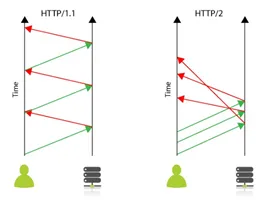

# gRPC란

### gRPC


**gRPC**는 google 사에서 개발한 오픈소스 RPC(Remote Procedure Call) 프레임워크입니다.


이전까지는 RPC 기능은 지원하지 않고, 메세지(JSON 등)을 Serialize할 수 있는 프레임워크인 PB(Protocol Buffer, 프로토콜 버퍼)만을 제공해왔는데, PB 기반 Serizlaizer에 HTTP/2를 결합하여 RPC 프레임워크를 탄생시킨 것이죠.

REST와 비교했을 때 기반 기술이 다르기에 특징도 많이 다르지만, 가장 두드러진 차이점은 HTTP/2를 사용한다는 것과 프로토콜 버퍼로 데이터를 전달한다는 점입니다. 그렇기에 Proto File만 배포하면 환경과 프로그램 언어에 구애받지 않고 서로 간의 데이터 통신이 가능합니다.

#### HTTP 2.0

http/1.1은 기본적으로 클라이언트의 요청이 올때만 서버가 응답을 하는 구조로 매 요청마다 connection을 생성해야만 합니다. cookie 등 많은 메타 정보들을 저장하는 무거운 header가 요청마다 중복 전달되어 비효율적이고 느린 속도를 보여주었습니다. 이에 http/2에서는 한 connection으로 동시에 여러 개 메시지를 주고 받으며, header를 압축하여 중복 제거 후 전달하기에 version1에 비해 훨씬 효율적입니다. 또한, 필요 시 클라이언트 요청 없이도 서버가 리소스를 전달할 수도 있기 때문에 클라이언트 요청을 최소화 할 수 있습니다.

<figure><figcaption>
HTTP/1.1 vs HTTP/2 connection 구조 (그림 출처 :<a href="https://jumpic.com/hashtag.php?q=http2">https://jumpic.com/hashtag.php?q=http2</a>)
</figcaption></figure>

#### Protocol Buffer


**Protocol Buffer**는 google 사에서 개발한 구조화된 데이터를 직렬화(Serialization)하는 기법입니다.


직렬화란, 데이터 표현을 바이트 단위로 변환하는 작업을 의미합니다. 아래 예제처럼 같은 정보를 저장해도 text 기반인 json인 경우 82 byte가 소요되는데 반해, 직렬화 된 protocol buffer는 필드 번호, 필드 유형 등을 1byte로 받아서 식별하고, 주어진 length 만큼만 읽도록 하여 단지 33 byte만 필요하게 됩니다.

<figure><figcaption>
Json vs Protocol Buffer 데이터 비교 (그림 출처 :<a href="https://martin.kleppmann.com/2012/12/05/schema-evolution-in-avro-protocol-buffers-thrift.html">https://martin.kleppmann.com/2012/12/05/schema-evolution-in-avro-protocol-buffers-thrift.html</a>)
</figcaption></figure>

{% embed url="https://medium.com/naver-cloud-platform/nbp-%EA%B8%B0%EC%88%A0-%EA%B2%BD%ED%97%98-%EC%8B%9C%EB%8C%80%EC%9D%98-%ED%9D%90%EB%A6%84-grpc-%EA%B9%8A%EA%B2%8C-%ED%8C%8C%EA%B3%A0%EB%93%A4%EA%B8%B0-1-39e97cb3460" %}
gRPC - 참고 사이트

